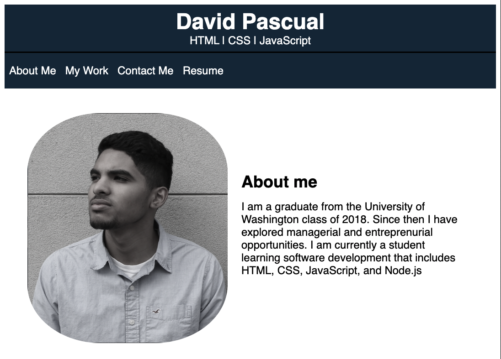
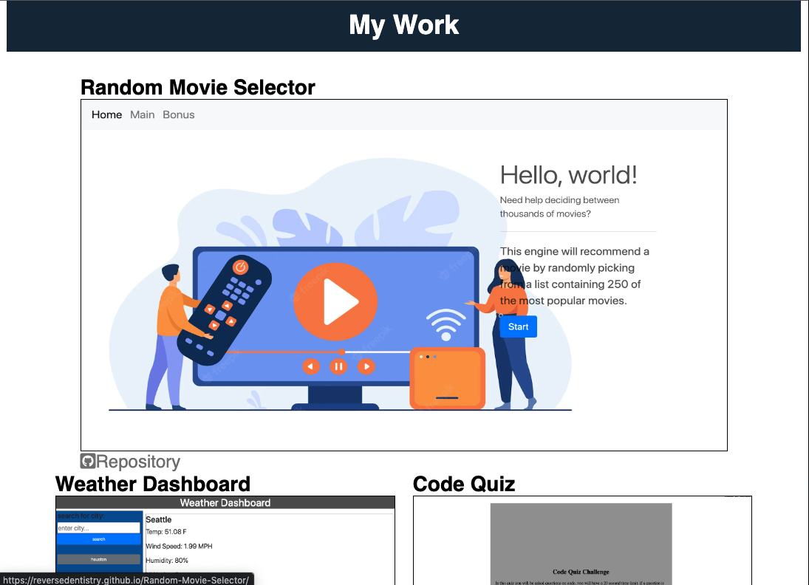

# Updated-Portfolio

## Description

This portfolio contains work that I have created, incldung a weather app that can tell the user the current weather and five day forcast for any city, a code quiz that lets to user take a timed quiz that will prompt several questions then give a score once complete, and random movie generator using third party APIs. The portfolio is responsive and contains a navigation bar to find the different sections of the portfolio. Lastly, contact information can be found at the bottom of the page. 

## Technologies
* HTML
* CSS
* Google Fonts

## Preview

## Deployed Page
[final product](https://davidpascual2.github.io/Updated-portfolio/)